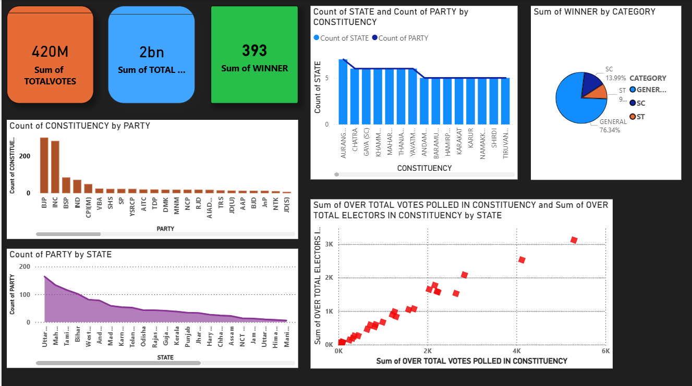
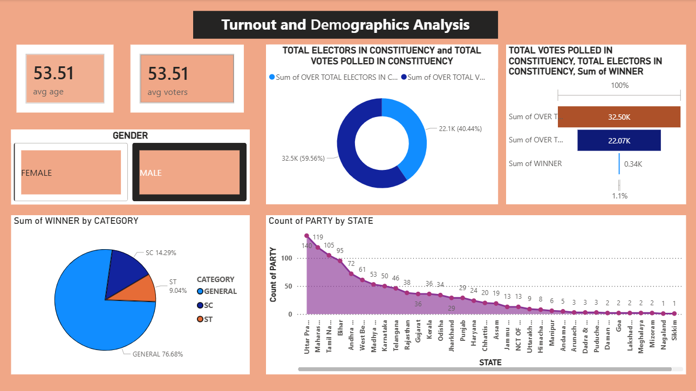

# 🗳️ India General Election 2019 - Power BI Dashboards


---

## 📌 Project Overview

This project presents **3 interactive Power BI Dashboards** built using the **Indian Candidates for General Election 2019** dataset from Kaggle. It provides deep insights into voter turnout, demographic analysis, party performance, candidate tracking, and constituency-level analysis — helping understand India's 2019 Lok Sabha electoral patterns through data.

---

## 🎯 Objective

To analyze the 2019 Indian Lok Sabha election data and visualize key electoral metrics through interactive Power BI dashboards, enabling quick identification of voting trends, party dominance, and demographic patterns across states and constituencies.

---

## 🖼️ Dashboard Screenshots

### 🔹 Dashboard 1 — Turnout and Demographics Analysis


### 🔹 Dashboard 2 — Party and Candidate Performance Tracker


### 🔹 Dashboard 3 — Election Overview


---

## 📊 Key KPIs & Features

### Dashboard 1 — Turnout and Demographics Analysis
| KPI | Description |
|-----|-------------|
| 👴 **Avg Age** | Average age of voters across constituencies |
| 🗳️ **Avg Voters** | Average number of voters per constituency |
| 👥 **Gender Split** | Male vs Female voter distribution |
| 🏆 **Winner by Category** | SC / ST / General category winner analysis |
| 📍 **Party Count by State** | Number of parties contesting per state |

### Dashboard 2 — Party and Candidate Performance Tracker
| KPI | Description |
|-----|-------------|
| 🗳️ **Total Votes (420M)** | Sum of all votes polled nationally |
| 📊 **Total Electors** | Total registered electors |
| 🏆 **Winner by State & Party** | Treemap of winners across states |
| 👤 **Candidate Tracker** | Search and filter individual candidates |

### Dashboard 3 — Election Overview
| KPI | Description |
|-----|-------------|
| 🗳️ **420M Total Votes** | Overall votes cast nationally |
| 👥 **2bn Total Electors** | Total registered voters |
| 🏆 **393 Winners** | Total constituency winners |
| 📊 **Constituency by Party** | Party-wise constituency distribution |
| 🗺️ **State-wise Analysis** | Votes polled vs electors by state |

---

## 🛠️ Tools & Technologies

| Tool | Purpose |
|------|---------|
|  | Dashboard & Visualizations |
|  | Data Source |
|  | Raw Election Data |

---

## 📂 Dataset Info

- **Name:** Indian Candidates for General Election 2019
- **Source:** [Kaggle](https://www.kaggle.com/datasets/prakrutchauhan/indian-candidates-for-general-election-2019)
- **File:** `LS_2_0.csv`
- **Contents:** Candidate names, party names, state, constituency, total votes, winner, category (General/SC/ST), total electors, votes polled, gender, age

---

## 📁 Folder Structure

```
India-Election-PowerBI-Dashboard/
│
├── 📁 dashboards/
│   ├── Turnout_Demographics_Analysis.pbix
│   ├── Party_Candidate_Performance.pbix
│   └── Election_Overview_Dashboard.pbix
│
├── 📁 data/
│   └── LS_2_0.csv                        # Lok Sabha Election Dataset
│
├── 📁 screenshots/
│   ├── turnout_demographics.png          # Dashboard 1 Screenshot
│   ├── party_candidate_performance.png   # Dashboard 2 Screenshot
│   └── election_overview.png            # Dashboard 3 Screenshot
│
└── 📄 README.md                          # Project Documentation
```

---

## 🚀 How to Use

1. Clone or download this repository
   ```bash
   git clone https://github.com/Purushothamreddy6749/India-Election-PowerBI-Dashboard.git
   ```
2. Open **Power BI Desktop** on your system
3. Open any `.pbix` file from the `dashboards/` folder
4. Explore the interactive dashboard — use slicers and filters to drill down

---

## 💡 Key Insights

- 🏆 **BJP** dominates in maximum number of constituencies across states
- 📍 **Uttar Pradesh** has the highest number of parties contesting
- 👥 **76.68%** of winners belong to the General category
- 🗳️ **420 Million** total votes were polled nationally
- 📊 Male voters outnumber female voters at **59.56% vs 40.44%**
- 🌍 Voter turnout varies significantly across Tier 1, 2, and 3 states

---

## 👤 Author

**Purushotham Reddy**
- 🐙 GitHub: [@Purushothamreddy6749](https://github.com/Purushothamreddy6749)
- 💼 LinkedIn: [R. Purushotham Reddy](https://www.linkedin.com/in/r-purushotham-reddy-97637b32b)

---

## 📜 License

This project is licensed under the **MIT License** — feel free to use and modify it.

---

⭐ **If you found this project helpful, please give it a star!** ⭐
